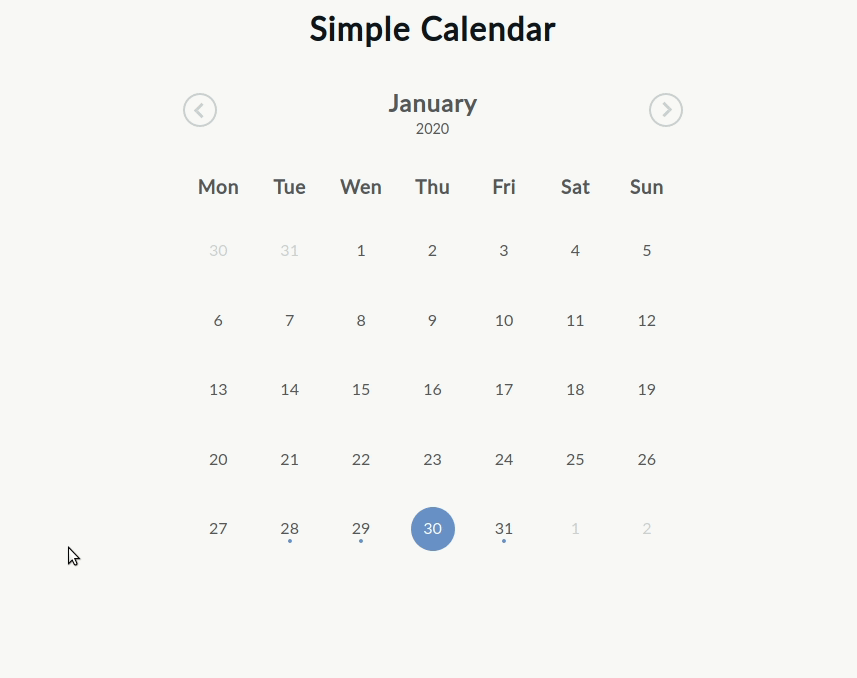

# Simple Calendar


A simple and easy plugin to create a calendar and add events to it.

## Usage


```javascript
<div id="container" class="calendar-container"></div>

<script src="https://code.jquery.com/jquery-2.2.4.min.js"
        integrity="sha256-BbhdlvQf/xTY9gja0Dq3HiwQF8LaCRTXxZKRutelT44="
        crossorigin="anonymous"></script>
<script src="dist/jquery.simple-calendar.js"></script>
<script>
  var $calendar;
  $(document).ready(function () {
    let container = $("#container").simpleCalendar({
      fixedStartDay: 0, // begin weeks by sunday
      disableEmptyDetails: true,
      events: [
        // generate new event after tomorrow for one hour
        {
          startDate: new Date(new Date().setHours(new Date().getHours() + 24)).toDateString(),
          endDate: new Date(new Date().setHours(new Date().getHours() + 25)).toISOString(),
          summary: 'Visit of the Eiffel Tower'
        },
        // generate new event for yesterday at noon
        {
          startDate: new Date(new Date().setHours(new Date().getHours() - new Date().getHours() - 12, 0)).toISOString(),
          endDate: new Date(new Date().setHours(new Date().getHours() - new Date().getHours() - 11)).getTime(),
          summary: 'Restaurant'
        },
        // generate new event for the last two days
        {
          startDate: new Date(new Date().setHours(new Date().getHours() - 48)).toISOString(),
          endDate: new Date(new Date().setHours(new Date().getHours() - 24)).getTime(),
          summary: 'Visit of the Louvre'
        }
      ],
      onMonthChange: function (month, year) {
       
        
          $.ajax({
                type: "POST",
                url: "ajax.php",
                data: {action: 'test'},
                dataType:'JSON', 
                success: function(response){
                    console.log(response);
                    $.each(response, function(i,v){
                      var newEvent = {
                          startDate: v.startDate,
                          endDate: v.endDate,
                          summary: v.summary
                        }
                        $calendar.addEvent(newEvent)
                    })
                    // put on console what server sent back...
                }
            });
      }

    });
    $calendar = container.data('plugin_simpleCalendar')
  });
</script>
```
